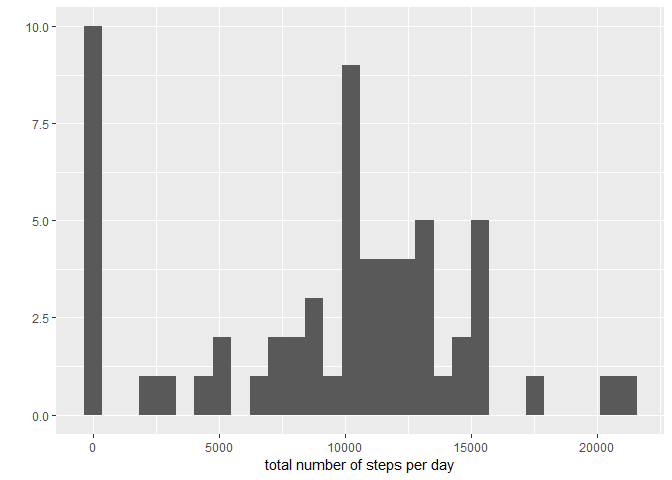
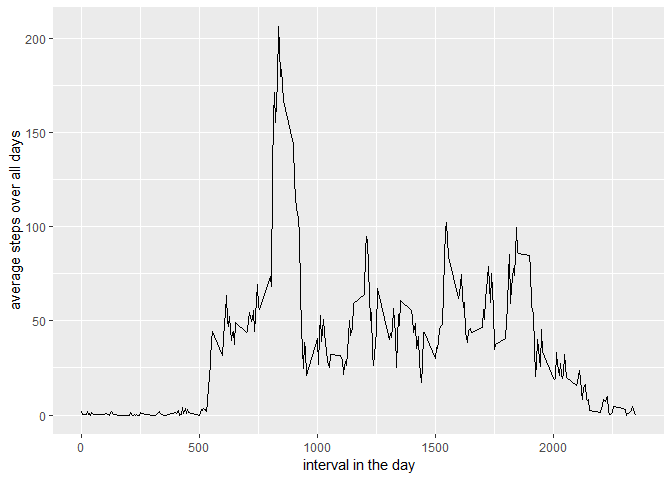
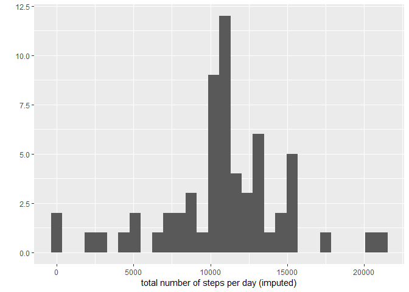
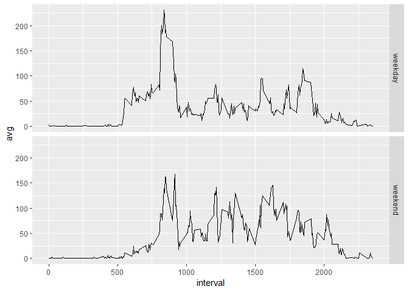

## Loading and preprocessing the data


```r
library(dplyr)
library(ggplot2)
```


```r
activity_data <- read.csv("activity.csv")
activity_data <- tbl_df(activity_data)
```


## What is mean total number of steps taken per day?

```r
total_steps_perday <- activity_data %>% group_by(date) %>% summarise(steps = sum(steps, na.rm=TRUE))
qplot(total_steps_perday$steps, geom="histogram", xlab="total number of steps per day")
```

```
## `stat_bin()` using `bins = 30`. Pick better value with `binwidth`.
```

<!-- -->

```r
median_steps_perday <- median(total_steps_perday$steps)
mean_steps_perday <- mean(total_steps_perday$steps)

print(paste0("Median of the total steps per day = ", median_steps_perday))
```

```
## [1] "Median of the total steps per day = 10395"
```

```r
print(paste0("Mean of the total steps per day = ", mean_steps_perday))
```

```
## [1] "Mean of the total steps per day = 9354.22950819672"
```


## What is the average daily activity pattern?

```r
avg_interval_data<- activity_data %>% group_by(interval) %>% summarise(avg = mean(steps, na.rm=TRUE))
qplot(interval, avg, data = avg_interval_data, geom="line", xlab="interval in the day", ylab="average steps over all days")
```

<!-- -->

```r
print(paste0("The interval with maximum daily average steps is  = ", avg_interval_data$interval[which.max(avg_interval_data$avg)]))
```

```
## [1] "The interval with maximum daily average steps is  = 835"
```


## Imputing missing values

```r
all_missing_rows = activity_data[is.na(activity_data$steps),]
print(paste0("Total number of missing values in the dataset is = ", nrow(all_missing_rows)))
```

```
## [1] "Total number of missing values in the dataset is = 2304"
```

```r
activity_data_imputed = activity_data


for(nr in 1:nrow(activity_data)){
        if(is.na(activity_data[nr,"steps"])){
                the_interval = as.numeric(activity_data[nr,"interval"])
                avg_steps = avg_interval_data[avg_interval_data$interval == the_interval,]
                avg_steps_val = as.numeric(avg_steps[1,"avg"])
                activity_data_imputed[nr, "steps"] = avg_steps_val
        }
}


total_steps_perday <- activity_data_imputed %>% group_by(date) %>% summarise(total_steps = sum(steps, na.rm=TRUE))
qplot(total_steps_perday$total_steps, geom="histogram", xlab="total number of steps per day (imputed)")
```

```
## `stat_bin()` using `bins = 30`. Pick better value with `binwidth`.
```

<!-- -->

```r
median_steps_perday <- median(total_steps_perday$total_steps)
mean_steps_perday <- mean(total_steps_perday$total_steps)

print(paste0("Median (imputed) of the total steps per day = ", median_steps_perday))
```

```
## [1] "Median (imputed) of the total steps per day = 10766.1886792453"
```

```r
print(paste0("Mean (imputed) of the total steps per day = ", mean_steps_perday))
```

```
## [1] "Mean (imputed) of the total steps per day = 10766.1886792453"
```


## Are there differences in activity patterns between weekdays and weekends?


```r
activity_data_imputed <- mutate(activity_data_imputed, lweekdays = weekdays(as.Date(date)))

activity_data_imputed <- mutate(activity_data_imputed, is_weekend = lweekdays %in% c("Saturday", "Sunday"))

activity_data_imputed[activity_data_imputed$is_weekend == TRUE,]$is_weekend = "weekend"
activity_data_imputed[activity_data_imputed$is_weekend == FALSE,]$is_weekend = "weekday"

data1 <- activity_data_imputed %>% group_by(interval, is_weekend) %>% summarise(avg = mean(steps))

ggplot(data1, aes(x=interval, y=avg)) + facet_grid(is_weekend ~ .) + geom_line()
```

<!-- -->


